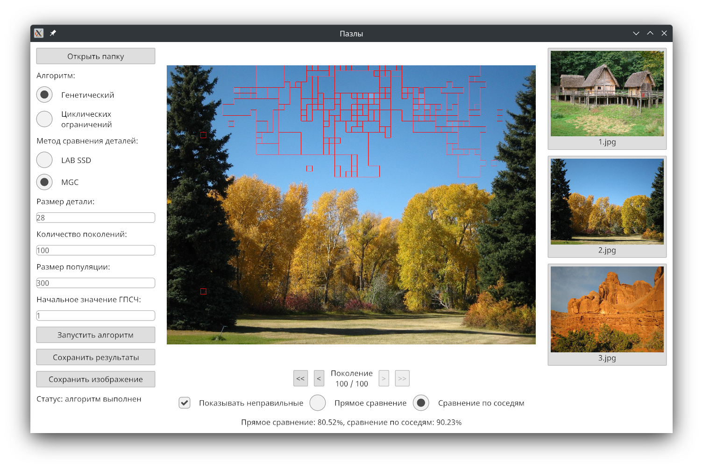

Курсовая работа "Реализация и сравнение алгоритмов автоматической сборки пазлов". В данной работе реализован генетический алгоритм и алгоритм циклических ограничений с методами сравнения деталей LAB SSD и MGC, а также графический интерфейс для их выполнения и просмотра результатов.

